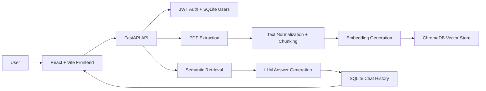
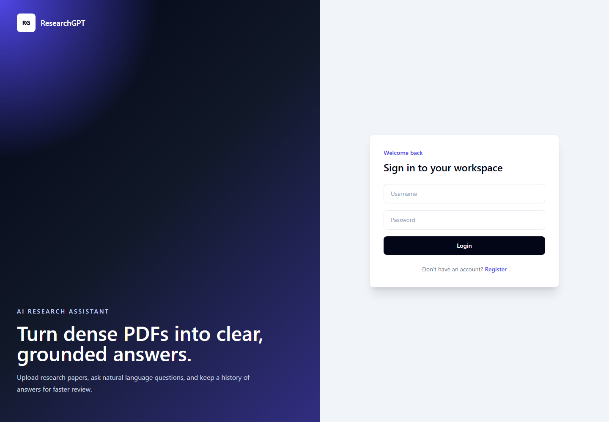
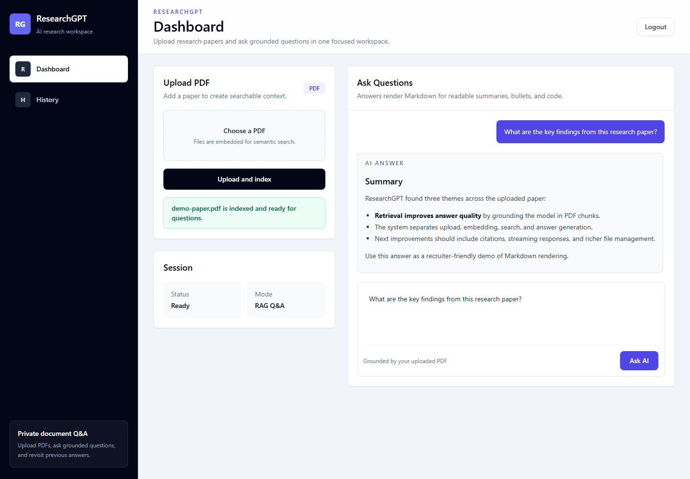
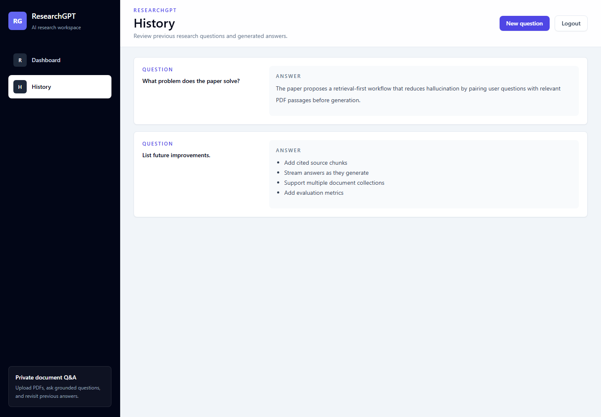

# ResearchGPT

ResearchGPT is an AI-powered research assistant that lets users upload PDF papers, index their content, and ask natural language questions against the uploaded material. It combines a React dashboard with a FastAPI backend, PDF parsing, embeddings, vector search, and LLM answer generation.

## Overview

The project demonstrates a full-stack Retrieval-Augmented Generation workflow:

1. A user registers or logs in.
2. The user uploads a PDF research paper.
3. The backend extracts, normalizes, chunks, and embeds the document text.
4. Chunks are stored in ChromaDB for semantic retrieval.
5. User questions retrieve relevant chunks and generate grounded AI answers.
6. Questions and answers are stored in chat history.

## Features

- JWT authentication for protected uploads, chat, and history.
- PDF upload and text extraction.
- Chunking and normalization pipeline for research documents.
- Embedding generation and ChromaDB vector storage.
- AI question answering over retrieved document context.
- Chat history per authenticated user.
- Modern React UI with sidebar navigation, loading spinners, chat bubbles, upload status, and Markdown answer rendering.

## Architecture



## Tech Stack

- **Frontend:** React, Vite, Tailwind CSS, Axios, React Router
- **Backend:** FastAPI, Uvicorn, SQLAlchemy, Pydantic
- **Auth:** JWT, Passlib, bcrypt
- **AI/RAG:** Hugging Face model API, sentence-transformers, ChromaDB
- **Documents:** PDF text extraction service
- **Database:** SQLite for users and chat history
- **Deployment:** Docker-ready FastAPI backend

## Screenshots

### Login Page



### Dashboard


### Upload Success



### AI Answer


### History Page



## Deployment Link

- Backend API: [https://researchgpt-249u.onrender.com](https://researchgpt-249u.onrender.com)
- Frontend: [https://researchgpt-frontend-d7voct573-navadeep0508s-projects.vercel.app/](https://researchgpt-frontend-d7voct573-navadeep0508s-projects.vercel.app/)

## API Endpoints

| Method | Endpoint | Auth | Description |
| --- | --- | --- | --- |
| `GET` | `/` | No | API health message |
| `POST` | `/api/v1/auth/register` | No | Create a new user |
| `POST` | `/api/v1/auth/login` | No | Log in and receive a bearer token |
| `POST` | `/api/v1/upload` | Yes | Upload a PDF, extract text, chunk it, embed it, and store vectors |
| `POST` | `/api/v1/chat` | Yes | Ask a question and receive a generated answer from retrieved context |
| `GET` | `/api/v1/history` | Yes | Fetch previous questions and answers for the logged-in user |

## Local Development

### Backend

```bash
python -m venv venv
venv\Scripts\activate
pip install -r requirements.txt
uvicorn app.main:app --reload
```

### Frontend

```bash
cd researchgpt-frontend
npm install
npm run dev
```

Create a `.env` file for backend secrets and model settings:

```env
HF_TOKEN=your_hugging_face_token
HF_MODEL=meta-llama/Llama-3.1-8B-Instruct
SECRET_KEY=replace_with_a_secure_secret
DATABASE_URL=sqlite:///./researchgpt.db
UPLOAD_DIR=uploads
```

## Future Improvements

- Add source citations with page numbers for every generated answer.
- Stream AI responses token-by-token in the chat UI.
- Support multiple PDFs and document collections per user.
- Add file management for deleting and re-indexing uploads.
- Add evaluation tests for retrieval quality and answer grounding.
- Deploy the React frontend and connect it to the hosted backend.
